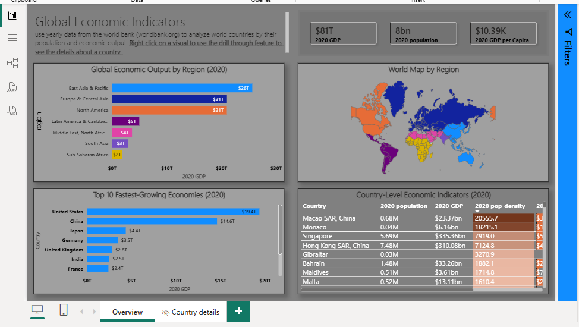
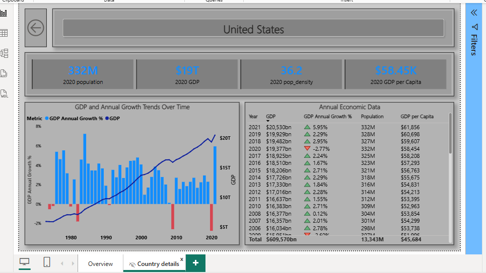

# 🌎 Power BI Project: Global Economic Indicators

---

## 🔺 Project Overview

This Power BI dashboard analyzes yearly data from the World Bank to explore **global economic indicators**, including GDP, population, population density, and GDP per capita.  
The dashboard enables users to **compare countries and regions**, track **economic growth over time**, and drill through for detailed country-level insights.  

**Purpose:** General analysis and learning purposes, providing interactive insights into global economic trends.

---

## 🔹 Dataset Overview

The model is built using **two final tables** derived from staging queries:

| Table Name | Description |
|------------|-------------|
| `Countries` | Country information including ID, name, region, capital, longitude, latitude, and 2020 land area |
| `Indicators` | Economic and demographic indicators for countries across years (GDP, population, etc.) |

**Staging Tables:**  
- `Source Countries` – raw country metadata  
- `Source Indicators` – raw World Bank indicator data  
- `Source Land Area by Country (2020)` – land area per country for 2020  
- `Indicators` – filtered indicator data  

---

## ⚙️ Tools & Techniques Used

- **Power BI Desktop** – data modeling, DAX measures, interactive visuals  
- **Power Query** – data cleaning, transformation, merging tables  
- **Data Relationships** – merged using country IDs; final model includes `Countries` and `Indicators`  
- **DAX Measures** – fixed-year KPIs, derived measures, and context-aware helper measures  

### 🧮 Key Measures

| Measure | Description |
|---------|-------------|
| `Sumindicatorvalue` | Sum of `Indicator value` in the current filter context. Base for indicator-specific measures. |
| `GDP` | Filters `Sumindicatorvalue` for `NY.GDP.MKTP.KD` (real GDP). |
| `Population` | Filters `Sumindicatorvalue` for `SP.POP.TOTL` (total population). |
| `2020 GDP` | Returns GDP for 2020, ignoring other year filters. |
| `2020 population` | Returns total population for 2020. |
| `2020 pop_density` | Calculates population density for 2020 (population ÷ land area). |
| `GDP per Capita` | GDP ÷ Population. |
| `GDP Annual Growth %` | Year-over-year GDP growth % based on selected year. |
| `Selected country` | Returns the currently selected country (for drill-through titles and visuals). |

---

## 🔹 Key Insights

- **Global economic output is heavily concentrated in a few regions**  
  - East Asia & Pacific: $25.7T  
  - Europe & Central Asia: $21T  
  - North America: $21T  
  - These three regions alone account for the majority of global GDP in 2020.  

- **Top 10 economies dominate global growth**  
  - US, China, Japan, Germany, UK, India, France, Brazil, Italy, Korea Republic  
  - Together they represent the bulk of global GDP and growth trends.  

- **Population vs GDP patterns**  
  - Countries with high GDP per capita may not have the largest populations (e.g., US, Germany)  
  - Countries with large populations do not always lead in GDP (e.g., India, Brazil).  

- **Fastest growing economies indicate economic shifts**  
  - Emerging economies (India, Korea Republic, Brazil) show significant growth trends relative to their 2020 GDP.  

- **Population density impacts economic interpretation**  
  - Smaller countries with high GDP per capita (e.g., some European nations) have very high productivity per person.  
  - Large countries with moderate GDP per capita (e.g., India) indicate growth potential if productivity improves.  

- **Drill-through allows granular country-level analysis**  
  - Users can analyze GDP trends, population growth, and per capita metrics over time for each country.  

---

## 🔍 Dashboard Pages

### 🟩 Main Page – Global Economic Indicators

**Top Row: KPI Cards**
- Title (raw text)  
- Multiple cards showing **2020 key metrics**:  
  - `[2020 GDP]`: $81 trillion  
  - `[2020 population]`: 8 billion  
  - `[2020 GDP per Capita]`: $10.39k  

**Middle Row: Regional Analysis**
- **Bar Chart** – *Global Economic Output by Region (2020)*  
  1. East Asia & Pacific – $25.7T  
  2. Europe & Central Asia – $21T  
  3. North America – $21T  
  4. Latin America & Caribbean – $5T  
  5. Middle East, North Africa, Afghanistan & Pakistan – $3.6T  
  6. South Asia – $2.9T  
  7. Sub-Saharan Africa – $1.8T  
- **World Map** – displays countries colored by region  

**Bottom Row: Country-Level Details**
- **Bar Chart** – *Top 10 Fastest Growing Economies (2020)*  
  - US – $19.4T, China – $14.6T, Japan – $4.4T, Germany – $3.5T, UK – $2.8T, India – $2.5T, France – $2.4T, Brazil – $1.7T, Italy – $1.7T, Korea Republic – $1.6T  
- **Table** – displays:  
  - Country, 2020 Population, 2020 GDP, 2020 Population Density, 2020 GDP per Capita  
  - Embedded line chart: GDP by year  

**Slicers / Interactivity**
- Filter by **year** or **country**  
- Tooltip shows **GDP trend over time** for selected country  

---

### 🟨 Drill-Through Page – Country-Level Economic Details

**Top Section**
- Large **card** showing `[Selected country]`  
- **Return button** to navigate back to the main dashboard  

**Middle Section**
- **Line and Stacked Column Chart** – GDP and Annual Growth Trends Over Time for selected country  
  - Line: GDP annual growth %  
  - Columns: GDP over years  

**Right Section**
- **Table – Annual Economic Data**  
  - Columns: Year, GDP, GDP Annual Growth %, Population, GDP per Capita  

**Interactivity**
- Clicking a country on the main page enables drill-through  
- Tooltip charts provide **additional insights**  

---

## 📸 Dashboard Previews

### 📄 Main Page

### 📄 Drill-Through Page

---

## 📂 Files & Visual Assets

- [`README.md`](./README.md) – Project documentation  
- [`US_Global_Econ_Indicators.pbix`](./US_Global_Econ_Indicators.pbix) – Power BI report file  
- 📸 Screenshots:  
  - [Main Page Overview](./main_page.png)  
  - [Drill-Through Page](./drillthrough_page.png)  

---

## 📢 Recommendations

- Use drill-through and tooltip features to explore **country-specific trends**  
- Analyze **fastest-growing economies** for investment or policy insights  
- Compare regions using **GDP and population KPIs** for strategic reporting  

